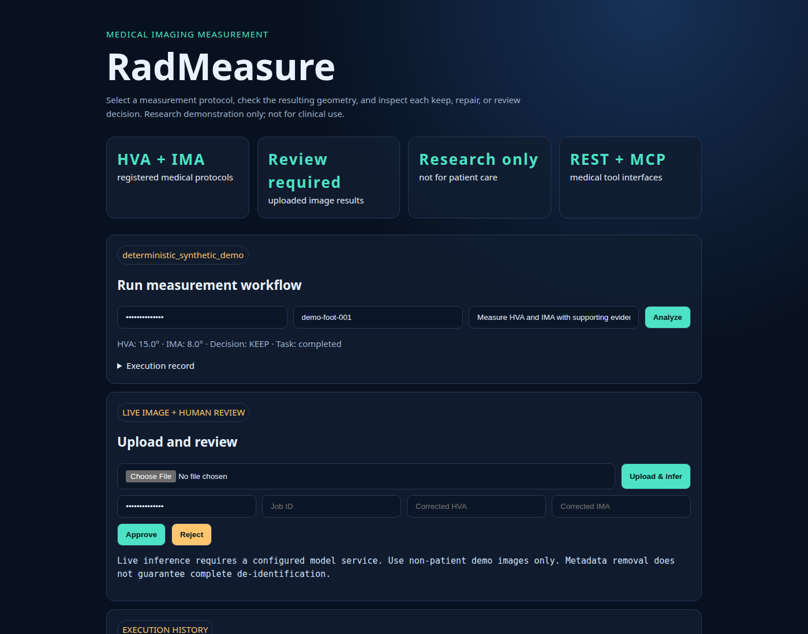
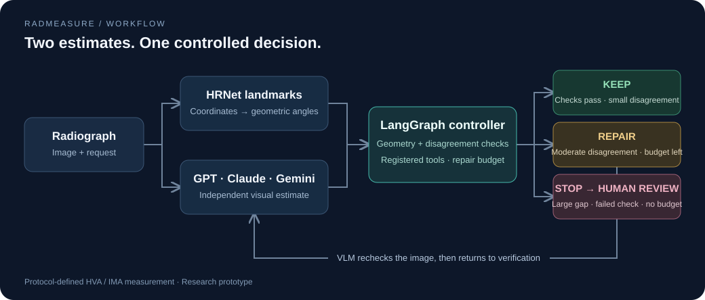

# RadMeasure

**A medical imaging measurement agent with geometric verification, bounded repair, and human review.**

[](https://github.com/jianghongcheng/radmeasure-agent/actions/workflows/ci.yml)
[](LICENSE)

RadMeasure coordinates measurement of **hallux valgus angle (HVA)** and
**intermetatarsal angle (IMA)** in foot radiographs. A constrained planner selects
registered protocols; measurement tools produce the angles; a controller checks
geometry and decides whether to keep, repair, or stop a result.

[Quick start](#quick-start) · [Architecture](#architecture) · [Results](#evaluation) · [Usage](docs/USAGE.md)

## Demo



The offline demo runs the planning, measurement, and verification path on synthetic
geometry without model downloads. Uploaded-image inference uses separately configured
weights and always requires review. [Run the web interface](docs/USAGE.md#local-api-and-dashboard).

## Architecture



Registered-case analysis and uploaded-image inference are distinct paths.
An optional LLM selects protocols and tools; it does not directly invent measured
angles or grant itself new tool permissions.

| Engineering decision | Implementation |
| --- | --- |
| Constrain tool selection | Protocol registry and validation of planner JSON; unsupported plans stop |
| Make correction explicit | KEEP / REPAIR / STOP controller, repair budgets, and independent-proposal checks |
| Preserve review decisions | Uploaded predictions require review; approvals, rejections, and corrected angles are recorded |
| Trace execution | Per-tool records, persisted jobs, worker leases, and replay lineage |
| Expose measurement tools | CLI, FastAPI dashboard, job API, and MCP |

[Source map and execution paths](docs/ARCHITECTURE.md)

## Evaluation

Historical selective-repair study on **176 archived cases**, with three saved
base-model predictions per case (**528 case-records**):

| Measure | Result |
| --- | ---: |
| Case-records selected for intervention | 106/528 (20.1%) |
| Mean angular error, before → after | 2.678° → 2.540° |
| Mean error reduction among intervened records | 0.69° |

These results evaluate an archived learned selection policy, not the default
runtime controller or fresh end-to-end image inference. The mean is over case-level
HVA/IMA errors. [Protocol, aggregate provenance, and failure analysis](docs/EVALUATION.md#historical-selective-repair-study)
keep this study separate from software checks and live-model evaluation.

## Quick start

Requires Python 3.10+:

```bash
git clone https://github.com/jianghongcheng/radmeasure-agent.git
cd radmeasure-agent
python -m venv .venv
source .venv/bin/activate
pip install -e .
radmeasure --question "Measure HVA and IMA"
```

The synthetic example returns HVA **15.0°**, IMA **8.0°**, verification results,
and a tool trace. To enable a local LLM planner or image inference, follow
[model setup](docs/USAGE.md#optional-llm-planner).

```bash
pip install -e '.[dev]'
python -m pytest -q
python scripts/evaluate_agent_decisions.py
```

**Stack:** Python, PyTorch image adapters, FastAPI, SQLite, MCP, Docker, GitHub Actions.

## Research use

Research prototype, not validated for diagnosis or patient care. Geometry checks
do not establish anatomical correctness. Use synthetic or authorized research
data; do not upload patient information to the demo. Weights and private
per-image artifacts are not distributed. [Data policy](data/README.md).

[Usage](docs/USAGE.md) · [Evaluation](docs/EVALUATION.md) · [Contributing](CONTRIBUTING.md) · [MIT license](LICENSE)
