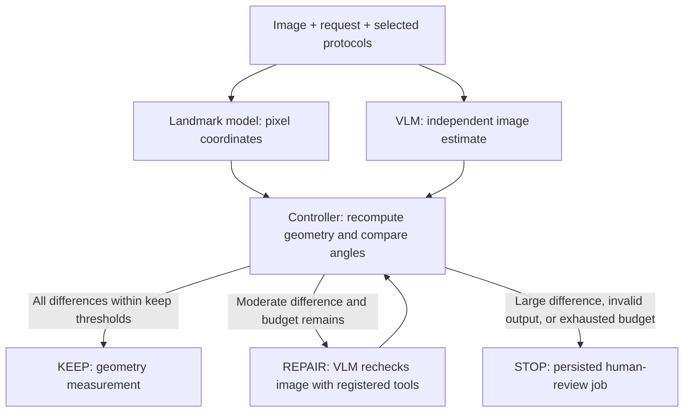

# Image-first measurement workflow

The uploaded-image path now uses LangGraph. Existing registered-case replay retains its separate execution path.



## Code boundaries

- `measurement_graph.py`: typed state, parallel branches, join, deterministic routing, bounded repair, audit output.
- `vision_measurement.py`: image-capable OpenAI-compatible HTTP adapter, protocol lookup and image crop tools, explicit environment configuration.
- `repair_inference.py`: additional `hvangle-landmarks` model ID returns original-image pixel coordinates from the existing landmark detector. It does not run the old learned repair network.
- `pipeline.py`: uploaded-image jobs invoke the graph. KEEP becomes `completed`; STOP becomes `needs_review`. Model errors and missing/invalid configuration do not produce fabricated measurements.
- `api.py`: multipart upload accepts `file`, `question`, and comma-separated `protocols` (`HVA`, `IMA`, or both). Existing reviewer API persists reviewed values and reviewer identity.

The first VLM call sees the image and registered definitions, but no landmark results. Repair feedback names the disagreeing protocols and supplies the VLM's previous estimate, without a target angle. The VLM can request only `get_protocol` and `view_region`; the controller alone authorizes `vlm_reestimate`. Each estimate permits at most two inspection tools followed by a final response. There is no shell or arbitrary Python tool.

The controller recomputes acute angles from finite, in-bounds, nondegenerate pixel axes. It also checks image-quality metadata, requested output coverage, finite angle ranges, and nonempty VLM evidence. These checks cannot establish that the detected anatomical axes are correct.

For each requested protocol, thresholds must satisfy `0 <= keep < stop <= 90`. All differences at or below their keep threshold lead to KEEP. Any difference above its stop threshold leads to STOP. The intermediate interval, including the stop boundary, allows REPAIR while budget remains; otherwise STOP. `max_repairs` is explicitly bounded to 0–5. Thresholds must be calibrated on separate development data; there are no validated clinical defaults.

## Configuration and local execution

Install with Python 3.11 or newer:

```sh
pip install -e '.[api,prod,vision,inference,dev]'
```

The inference service requires a compatible HRNet landmark checkpoint:

```sh
export RADMEASURE_LANDMARK_CHECKPOINT=/absolute/path/to/hrnet_lm.pt
export RADMEASURE_MODEL_DEVICE=cpu
export RADMEASURE_INFERENCE_TOKEN=your-local-service-token
uvicorn radmeasure.inference_api:create_app --factory --port 8100
```

In the worker environment, configure:

- `RADMEASURE_INFERENCE_URL=http://127.0.0.1:8100` and matching inference token.
- Select GPT, Claude, or Gemini and supply model credentials in the browser, or use the provider environment variables below.
- For a custom compatible endpoint only: `RADMEASURE_VLM_URL` ending in `/v1`, `RADMEASURE_VLM_MODEL`, and optional `RADMEASURE_VLM_API_KEY`.
- `RADMEASURE_DISCREPANCY_POLICY`: JSON containing `keep_degrees` and `stop_degrees` maps with HVA and IMA entries, and `max_repairs`. Supply your chosen development policy; the test suite's numbers are illustrative only.
- Shared `RADMEASURE_JOB_DB` and `RADMEASURE_ARTIFACT_ROOT` for API and worker, or the existing PostgreSQL/S3 settings.
- Existing registered-case endpoints need their replay artifacts. For a self-contained local harness set `RADMEASURE_DEMO_MODE=1` and `RADMEASURE_EVAL_REPLAY=0`; this enables labeled synthetic registered-case examples only. Uploaded images still require both configured models and never use those synthetic predictions.
- `RADMEASURE_API_KEYS`: the existing JSON mapping of keys to names and roles.

For complete local app environment commands and database initialization, see [Usage](USAGE.md). Start API and worker in separate terminals using the same environment:

```sh
uvicorn radmeasure.api:create_app --factory --port 8000
radmeasure-worker
```

Submit an image:

```sh
curl http://127.0.0.1:8000/v1/uploads \
  -H 'x-api-key: YOUR_OPERATOR_KEY' -H 'idempotency-key: image-case-001' \
  -F 'file=@foot.png' -F 'question=Measure HVA and IMA' -F 'protocols=HVA,IMA'
```

Poll the returned job ID at `/v1/jobs/{job_id}`. For a stopped case, a reviewer can reject it or supply reviewed measurements via `/v1/jobs/{job_id}/review`; approval requires values matching the requested protocols. The original decision, candidate measurements, initial/final VLM estimates and execution record remain available.

`RADMEASURE_MEASUREMENT_WORKFLOW=legacy` explicitly selects the previous upload behavior. The default is the new graph. Docker images do not bundle medical data or weights; configure/mount these separately. Compose mounts the landmark checkpoint and shares a private credential volume between API and workers.

## Interpretation and validation limits

KEEP publishes the landmark-derived angle. REPAIR revises the VLM second opinion, not landmark coordinates or the primary measurement. Agreement is not ground truth: both branches may be wrong. Do not describe this implementation as having demonstrated lower primary MAE.

Historical offline repair metrics belong to a different policy. This change does not reproduce or inherit those metrics. Evaluate the new graph against held-out reference measurements, reporting accepted-case accuracy, review rate, repair success/failure and cost.

Execution traces are saved with the job result. The graph constructor accepts an optional checkpointer, but the default worker integration does not persist intermediate LangGraph checkpoints. Worker recovery can restart a job; it is not a demonstrated exactly-once or mid-node-resume guarantee.

Tests use synthetic image bytes, fake landmark outputs and mocked VLM transport to verify control flow, image payloads, tool limits, failures, persistence and review. Real checkpoint/VLM accuracy and Docker deployment have not been validated in this change.

## Minimal browser interface

The homepage accepts one image and a measurement API selection. It shows HVA/IMA angles for KEEP, or “Human review” with a reason for STOP. Historical metrics, JSON, trace panels and manual-review controls are no longer shown on the homepage. The existing review API remains available.

Additional image-capable, OpenAI-compatible connections can be configured using `RADMEASURE_VLM_PROFILES` in both API and worker environments:

```json
{"local":{"label":"Local vision API","url":"http://localhost:8001/v1","model":"your-vision-model","api_key":"your-key"}}
```

The default connection still uses `RADMEASURE_VLM_URL`, `RADMEASURE_VLM_MODEL` and `RADMEASURE_VLM_API_KEY`. `/v1/measurement-apis` exposes only profile IDs, labels and connection-configured flags; it does not test model availability or expose keys. The upload stores only the selected `api_profile` ID. Landmark inference and discrepancy policy must also be configured. The expandable app access key is for RadMeasure authentication, not the external model credential.

### Built-in GPT, Claude and Gemini options

The selector now always offers GPT (OpenAI), Claude (Anthropic), and Gemini (Google). Enter an image-capable model ID and its API key directly on the form. Native adapters use OpenAI Responses, Anthropic Messages, and Gemini generateContent respectively. Custom compatible profiles remain supported.

Submitted credentials are written into owner-readable files (0600) under `RADMEASURE_PROVIDER_CREDENTIAL_DIR`, defaulting to `provider-credentials` next to the job database. Jobs contain an opaque reference only; public API responses and execution traces never contain the key. API and worker must share this directory. Files persist for pending work/replay and must be removed when no longer needed; this local demo store is not an encrypted production secret manager. A production deployment should replace it with a secret manager and tenant authorization. Do not expose this local demo with its demo access keys publicly.

Alternatively set `OPENAI_API_KEY`/`OPENAI_MODEL`, `ANTHROPIC_API_KEY`/`ANTHROPIC_MODEL`, or `GEMINI_API_KEY`/`GEMINI_MODEL` on the server. The UI exposes the configured model name but never the key. Provider configuration alone does not supply the landmark checkpoint or calibrated discrepancy policy.

The provider request formats follow [OpenAI image inputs](https://developers.openai.com/api/docs/guides/images-vision), [Claude vision](https://platform.claude.com/docs/en/build-with-claude/vision), and [Gemini generateContent](https://ai.google.dev/api/generate-content). Native image payloads, response parsing, blocked/truncated responses and upload credential separation are tested with mocked HTTP responses; no paid provider inference was performed in this change.
